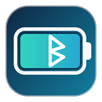
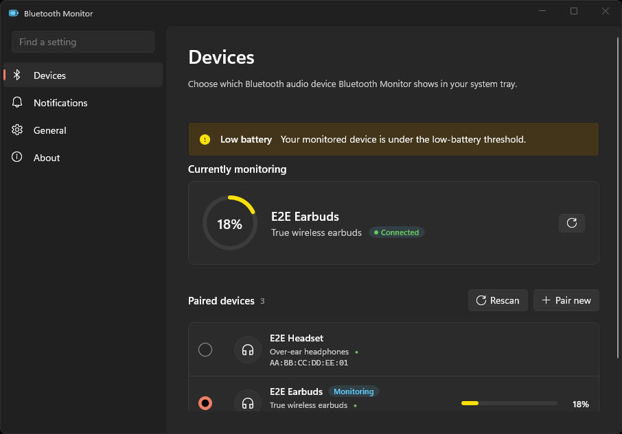

<div align="center">
  
  <h1>Bluetooth Monitor</h1>
  <p>See battery levels for paired Bluetooth audio devices on Windows.</p>
  <p>
    <a href="https://github.com/nazimkov/bluetooth-monitor/actions/workflows/build.yml">
      
    </a>
  </p>
</div>



## Main features

Bluetooth Monitor is a Windows tray application that:

- Finds paired Bluetooth audio devices and shows their connection state.
- Reads battery levels for Bluetooth Low Energy and Classic Bluetooth devices.
- Shows one monitored device in the main window and keeps the selected device after navigation.
- Refreshes device data on demand and at a configurable interval.
- Shows low and critical battery warnings in the app and in Windows notifications.
- Lets you set the low-battery threshold, notification style, alert sound, and critical-alert option.
- Supports System, Light, and Dark themes.
- Can start at sign-in and keep running when the window closes.
- Runs in the system tray and provides Show, Rescan, Settings, and Exit actions.
- Provides a Pair new action that opens Windows Bluetooth settings.
- Stores settings locally. Bluetooth polling does not send data over the network.

The current V1 scope has these limits:

- Earbud left, right, and case levels are not separate. The app shows one level.
- Bluetooth codec information is not available from Windows.
- Do Not Disturb silencing is displayed but disabled because Windows does not expose the required state.
- Settings search, automatic updates, and in-app pairing are not implemented.

## Build from source

Install the .NET 8 SDK and the Windows 10 SDK version 22621 or later. Then run:

```powershell
dotnet build BluetoothMonitor.slnx -c Debug -p:Platform=x64
```

## Install the package

1. Download the `.msix` file from the [GitHub releases page](https://github.com/nazimkov/bluetooth-monitor/releases).
2. Open the file and follow the app installer steps.

If Windows reports a certificate or publisher error, install the certificate
from the MSIX file:

1. Right-click the `.msix` file and select **Properties**.
2. Open **Digital Signatures**.
3. Select the signature in the list and click **Details**.
4. Click **View Certificate**.
5. Click **Install Certificate**.
6. When prompted, choose **Local Machine**. Administrator approval is
   required.
7. Choose **Place all certificates in the following store**.
8. Select **Trusted People**.
9. Finish the certificate import.
10. Run the app installer again.
